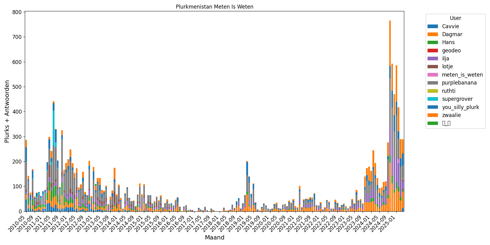

# Plurk Activity Visualization

This project retrieves data from Plurk's API and generates stacked bar chart visualizations of posting activity over time.

## Features
- Fetches Plurk timeline data and replies via API
- Stores data in SQLite database (`plurks.db`) with proper schema
- Generates monthly stacked bar charts showing:
  - Posting activity by user
  - Combined plurks and replies
  - Time-based trends
- Multiple colormap options for better visualization
- Automatic handling of missing months
- Configurable chart size and resolution

## Prerequisites
- Python 3.x
- Required packages (install via pip):
  ```bash
  pip install matplotlib pandas requests requests-oauthlib python-dotenv
  ```

## Setup & Authentication
1. Create a `.env` file with your Plurk API credentials:
   ```ini
   CONSUMER_KEY=your_key_here
   CONSUMER_SECRET=your_secret_here
   ```

2. Run the main script:
   ```bash
   python plurk_data_collector.py
   ```

3. During first run:
   - You'll be prompted to authorize the app via Plurk's OAuth flow
   - A verification code will be displayed that you need to paste back in
   - The script will then store your timeline data in the database

## Generating Visualizations
To create default visualization:
```bash
python plurk_barchart.py
```

This will generate `combined_activity_tab20.png` using:
- The 'tab20' colormap
- 2x scaling factor

### Advanced Plotting Options
You can modify `plot.py` to:
1. Use different colormaps (uncomment the colormaps_to_try section)
2. Adjust the scale factor (default is 2.0)
3. Change the output filename

Example colormaps available:
- 'tab20' (default)
- 'Set1', 'Pastel1', 'Dark2' 
- 'viridis', 'plasma', 'Spectral'

## Database Schema
The SQLite database (`plurks.db`) contains 3 tables:
- `plurks`: Main plurk posts
- `users`: User information
- `replies`: Reply data

## Troubleshooting
- If you get API errors, check your `.env` credentials
- Delete `plurks.db` to start fresh if needed
- For plotting issues, try reducing the scale factor

## Example Output

